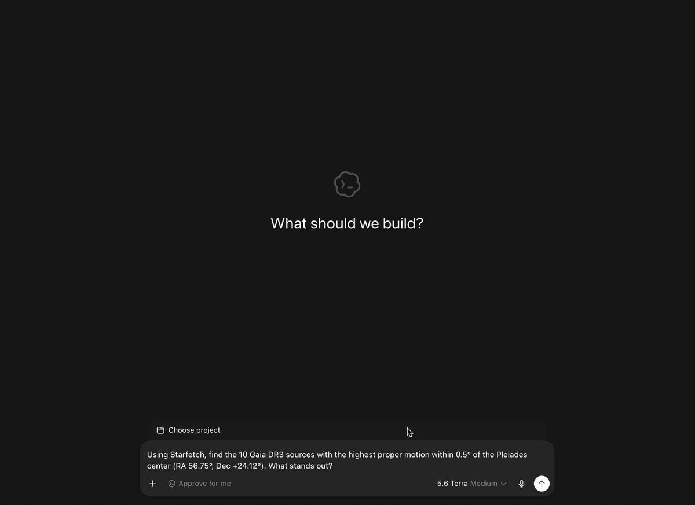

# Starfetch

<p align="center">
  
</p>

Starfetch gives AI agents safe, reproducible access to public astronomy
catalogs through the
[Model Context Protocol (MCP)](https://modelcontextprotocol.io/docs/getting-started/intro).

Ask an astronomy question in natural language. A Starfetch-enabled agent can
select an appropriate service, inspect its live tables and columns, construct
a bounded ADQL query, execute it, and return the result with the exact service,
table, query, limit, units, and assumptions it used.

<p align="center">
  
</p>

```text
You: Find the 10 Gaia DR3 sources with the highest proper motion within 0.5
     degrees of the Pleiades center at RA 56.75°, Dec +24.12°. What stands out?

Agent: selects Gaia → inspects metadata → runs bounded ADQL →
       returns catalog rows, exact ADQL, units, and assumptions
```

Representative captured result:

```text
Service: ESA Gaia Archive
Table: gaiadr3.gaia_source
Rows returned: 10
Query limit: TOP 10 / MAXREC 10

Highest returned proper motions:
- Gaia DR3 66780900298410496: 244.48 mas/yr
- Gaia DR3 66524409149512064: 184.50 mas/yr

Exact ADQL:
SELECT TOP 10 source_id, ra, dec, pm, pmra, pmdec, parallax, parallax_error,
  phot_g_mean_mag, bp_rp, ruwe
FROM gaiadr3.gaia_source
WHERE CONTAINS(POINT('ICRS', ra, dec), CIRCLE('ICRS', 56.75, 24.12, 0.5)) = 1
  AND pm IS NOT NULL
ORDER BY pm DESC
```

Gaia, SIMBAD, VizieR, the NASA Exoplanet Archive, and IRSA are available as
built-in service presets. Agents can also discover and query other public TAP
services by URL. Starfetch remains TAP-native and keeps ADQL visible, so the
agent workflow is convenient without becoming a scientific black box.

## Start here

- [Connect an agent](#connect-an-agent)
- [What the agent does](#what-the-agent-does)
- [Why Starfetch?](#why-starfetch)
- [Reliability without hidden assumptions](#reliability-without-hidden-assumptions)
- [Optional Starfetch skill](#optional-starfetch-skill)
- [Supported scope](#supported-scope)
- [CLI and TypeScript](#cli-and-typescript)
- [Run the Gaia proper-motion demo](#run-the-gaia-proper-motion-demo)
- [Development](#development)

## Connect an agent

Register Starfetch with the agent client that will launch it. Running the MCP
package by itself only starts a stdio server; it does not connect that server to
an agent.

### Codex

Register Starfetch for the Codex CLI, IDE extension, and ChatGPT desktop app:

```sh
codex mcp add starfetch -- npx -y @starfetch-js/mcp
codex mcp list
```

These Codex surfaces share MCP configuration. See the
[official Codex MCP documentation](https://developers.openai.com/codex/mcp).

### Claude Code

Register Starfetch in user scope:

```sh
claude mcp add --scope user --transport stdio starfetch -- npx -y @starfetch-js/mcp
claude mcp get starfetch
```

See the
[official Claude Code MCP documentation](https://docs.anthropic.com/en/docs/claude-code/mcp).

### Cursor

Add this server entry to `~/.cursor/mcp.json` for global use or
`.cursor/mcp.json` for one project:

```json
{
  "mcpServers": {
    "starfetch": {
      "command": "npx",
      "args": ["-y", "@starfetch-js/mcp"]
    }
  }
}
```

See the
[official Cursor MCP documentation](https://docs.cursor.com/context/model-context-protocol).

Other MCP clients can use the same stdio command and arguments through their
own server-registration interface:

```text
command: npx
args: -y @starfetch-js/mcp
```

Restart or reload the client after registration, then ask a normal astronomy
question. You should not need to write ADQL or name Starfetch tools in the
prompt. Starfetch requires Node.js 22 or newer.

## What the agent does

For a service-specific catalog question, Starfetch guidance teaches the agent
to:

1. choose an explicit service preset or public TAP URL;
2. check service availability when appropriate;
3. inspect relevant tables and the selected table's columns;
4. construct ADQL only from discovered schema information;
5. bound exploratory work with ADQL `TOP`, TAP `MAXREC`, or both;
6. execute the smallest useful query;
7. return the service, table, exact ADQL, effective limit, format, units, and
   relevant assumptions;
8. return to metadata after a schema or syntax failure instead of guessing.

The agent should never present a timeout, availability failure, parse error, or
query error as an empty scientific result. A successful zero-row result and a
failed request are different outcomes.

Starfetch exposes tools for the complete workflow:

```text
starfetch_list_presets
starfetch_registry_search
starfetch_tap_availability
starfetch_tap_capabilities
starfetch_tap_tables
starfetch_tap_columns
starfetch_tap_query
starfetch_tap_submit_job
starfetch_tap_job_status
starfetch_tap_job_wait
starfetch_tap_job_fetch
starfetch_tap_job_delete
```

Query tools return result data separately from diagnostics. They preserve the
exact submitted ADQL and effective row limit for reproduction and review.
Synchronous queries and async submissions send TAP `MAXREC=100` when `maxrec`
is omitted.

## Why Starfetch?

Starfetch is a useful middle layer when an agent needs live public catalog data
without turning the workflow into a black box:

- it inspects live schemas instead of guessing table and column names;
- it bounds public-service queries by default and preserves service failures;
- it returns exact ADQL, limits, units, and assumptions for reproduction;
- it provides one metadata-first interface across several TAP services; and
- its CLI and TypeScript library can reproduce an agent's query outside the
  agent client.

Use an archive's own interface, PyVO/Astropy, or local analysis tools instead
when you need authenticated/private archives, extensive local analysis, image
data processing, or authoritative astrophysical interpretation.

## Reliability without hidden assumptions

The MCP server works without installing a filesystem skill. Starfetch carries
the same canonical guidance through three overlapping layers:

| Layer                     | Role                                                                            |
| ------------------------- | ------------------------------------------------------------------------------- |
| MCP tool descriptions     | Minimum metadata-first and bounded-query contract available to every MCP client |
| MCP prompts and resources | Discoverable workflows, ADQL guidance, service notes, and examples              |
| Optional Starfetch skill  | Rich multi-step behavior across longer agent interactions                       |

The server exposes the retrievable prompts `query_astronomy_catalog`,
`explore_service`, `run_cone_search`, and `troubleshoot_adql`. Canonical
Markdown resources are available under `starfetch://guides/`,
`starfetch://services/`, and `starfetch://examples/`.

Prompt and resource support depends on the MCP client. Tool descriptions remain
self-sufficient for basic safe operation when a client exposes tools only. The
optional skill contains the full workflow, service references, and examples.

## Optional Starfetch skill

Install the skill when the agent client supports filesystem skills and you want
the strongest multi-interaction behavior. The skill is recommended, not
required by the MCP server.

Inspect or install the packaged skill:

```sh
npx -y @starfetch-js/cli skill print
npx -y @starfetch-js/cli skill install --target codex
npx -y @starfetch-js/cli skill install --target claude-code --scope project
npx -y @starfetch-js/cli skill install --target cursor
```

Install into a custom final skill directory with:

```sh
npx -y @starfetch-js/cli skill install --path ./starfetch-skill
```

Use `--dry-run` to preview file actions. Default destinations are:

- Codex user scope: `~/.codex/skills/starfetch`
- Claude Code user scope: `~/.claude/skills/starfetch`
- Codex project scope: `.codex/skills/starfetch`
- Claude Code project scope: `.claude/skills/starfetch`
- Cursor project scope: `.cursor/rules/starfetch.mdc`

Codex and Claude Code default to user scope. Cursor defaults to project scope
because its rules are project files.

## Supported scope

Starfetch is designed for public astronomical Table Access Protocol services.
It currently provides:

- built-in presets for `gaia`, `simbad`, `vizier`, `exoplanetarchive`, and
  `irsa`;
- VO registry search for additional TAP endpoints;
- VOSI availability, capabilities, table, and column metadata;
- bounded synchronous ADQL queries;
- explicit TAP/UWS async job submission, status, wait, fetch, and deletion;
- VOTable, CSV, and TSV requests, plus safe JSON and JSONL conversion;
- exact query and limit diagnostics.

Starfetch does not accept credentials or implement authenticated TAP workflows.
The MCP server does not execute shell commands or write local result files.
Starfetch retrieves catalog data; it does not validate astrophysical
interpretations or reconcile scientific differences between catalogs.

VOTable TABLEDATA and inline base64 BINARY/BINARY2 rows can be converted.
VOTable FITS rows, remote streams, and compressed streams remain pass-through
or unsupported for local row conversion.

## CLI and TypeScript

MCP is the primary agent interface. The CLI is useful for scripting, inspecting
a query outside an agent, and reproducing the exact request an agent reported.
The TypeScript library supports applications and custom adapters.

### CLI quickstart

Install or run the CLI once:

```sh
npm install -g @starfetch-js/cli
npx -y @starfetch-js/cli tap tables --service gaia
```

Inspect metadata before writing service-specific ADQL:

```sh
starfetch tap availability --service gaia
starfetch tap tables --service gaia
starfetch tap columns --service gaia --table gaiadr3.gaia_source
```

Run a bounded query:

```sh
starfetch tap query \
  --service gaia \
  --query "SELECT TOP 5 source_id, ra, dec FROM gaiadr3.gaia_source" \
  --format json
```

ADQL can come from `--query`, a file, or stdin. Result data can be written with
`--out`:

```sh
starfetch tap query --service gaia --file query.sql --format csv --out result.csv
cat query.sql | starfetch tap query --service gaia --format jsonl
```

Use `--service` for a preset or `--url` for an explicit TAP base URL. If both
are supplied, `--url` selects the endpoint and the service name remains as
diagnostic context.

Discover additional services through the VO registry:

```sh
starfetch tap registry search gaia --maxrec 5 --format json
```

### Async jobs

Use explicit async jobs for larger justified queries:

```sh
starfetch tap jobs submit \
  --service gaia \
  --query "SELECT TOP 10 source_id, ra, dec FROM gaiadr3.gaia_source" \
  --maxrec 10

starfetch tap jobs status <job-url>
starfetch tap jobs wait --interval 2000 --timeout 120000 <job-url>
starfetch tap jobs fetch <job-url> --format votable --out result.xml
starfetch tap jobs delete <job-url>
```

Absolute job URLs are sufficient for follow-up commands. Bare job IDs require
`--service` or `--url` so Starfetch can resolve the TAP `/async` endpoint.

### TypeScript API

Install `@starfetch-js/core` when a script, app, or custom agent adapter needs
direct TAP access:

```sh
npm install @starfetch-js/core
```

```ts
import { registry, tap } from "@starfetch-js/core";

const client = tap("gaia");
const columns = await client.columns("gaiadr3.gaia_source");
const result = await client.query(
  "SELECT TOP 5 source_id, ra, dec FROM gaiadr3.gaia_source",
  { format: "votable", maxrec: 5 },
);

console.log(columns.length);
console.log(await result.json());

const services = await registry().searchTapServices({
  query: "gaia",
  maxrec: 5,
});
console.log(services[0]?.accessUrl);
```

`tap(target)` accepts a known preset, a TAP base URL, or an object containing a
service and/or URL. Metadata methods read TAP `/availability`, `/capabilities`,
and `/tables`; sync queries use `/sync`, and explicit jobs use `/async`.

## Run the Gaia proper-motion demo

Reproduce the demo's metadata-first Gaia query and print the exact ADQL,
effective limit, and returned rows:

```sh
git clone https://github.com/starfetch-js/starfetch.git
cd starfetch
npm ci
npm run build
node examples/quickstart/run.mjs
```

This command queries the public Gaia TAP service. For more CLI, TypeScript API,
live TAP, and MCP Inspector workflows, see
[starfetch-js/examples](https://github.com/starfetch-js/examples). Each example
includes its exact ADQL, expected columns, and a cross-platform Node.js runner.

```sh
git clone https://github.com/starfetch-js/examples.git
cd examples
npm ci
node 01-gaia-nearby-stars/run.mjs
```

Launch MCP Inspector from that repository with:

```sh
npm run inspect:mcp
```

## Packages

- `@starfetch-js/mcp`: primary stdio MCP server and packaged agent guidance.
- `@starfetch-js/skill`: optional distributable Starfetch agent skill.
- `@starfetch-js/cli`: scripting, TAP inspection, query, async job, and skill
  installation commands.
- `@starfetch-js/core`: reusable TAP, VOSI, UWS, VOTable, registry, and output
  conversion primitives.

## Development

Install dependencies with the committed lockfile:

```sh
npm ci
```

The workspace requires Node.js `>=22.13.0`. Run:

```sh
npm run format:check
npm run lint
npm run typecheck
npm test
npm run build
npm run smoke:cli
```

Release-sensitive agent surface checks are:

```sh
npm --workspace packages/mcp run typecheck
npm --workspace packages/mcp run test
npm --workspace packages/mcp run build
npm --workspace packages/mcp run smoke

npm --workspace packages/skill run typecheck
npm --workspace packages/skill run test
npm --workspace packages/skill run build
```

Default tests use local fixtures and mocks only. Optional live TAP checks are
explicit:

```sh
npm run test:live:tap
```

## License

MIT
